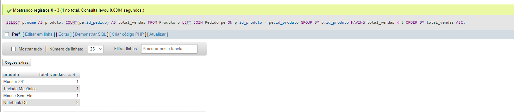

Projeto AV3 - Sistema de Gerenciamento de Vendas Online

Título do Projeto
Sistema de Controle de Pedidos para E-commerce

Modelagem de banco de dados para um e-commerce simples, com foco em clientes, produtos e pedidos.

Tema:
Desenvolvimento de um banco de dados relacional para gestão de:

Cadastro de clientes

Catálogo de produtos

Processamento de pedidos

Descrição do Problema Modelado:
O sistema foi desenvolvido para resolver os seguintes desafios:

Controle inadequado de pedidos em planilhas manuais

Dificuldade em analisar o desempenho de produtos

Falta de integração entre informações de clientes e vendas

Processos manuais para identificar clientes inativos.

Entidades Principais
Entidade    Descrição    Atributos Chave
Cliente    Armazena dados dos compradores    id_cliente, nome, telefone, email
Produto    Cadastro dos itens disponíveis    id_produto, nome, preco
Pedido    Registro das transações comerciais    id_pedido, data, quantidade

Relacionamentos
Cliente → Pedido (1:N)

Um cliente pode fazer vários pedidos

Implementado via chave estrangeira id_cliente em Pedido

Produto → Pedido (1:N)

Um produto pode aparecer em vários pedidos

Relacionamento através de id_produto em Pedido

O modelo foi normalizado até a Terceira Forma Normal (3FN), garantindo ausência de redundâncias e dependências transitivas

Prints das consultas realizadas SGBD: MySQL (XAMPP)

lista clientes inativos ultimos 6 meses

faturamento mensal 2023

Clientes Premium Top 10 por Valor Gasto

analise produtos lucratividade ranking

alerta estoque critico baixa rotatividade

Relatório de Pedidos Recentes: Clientes, Produtos e Datas Últimos 25 Registros

